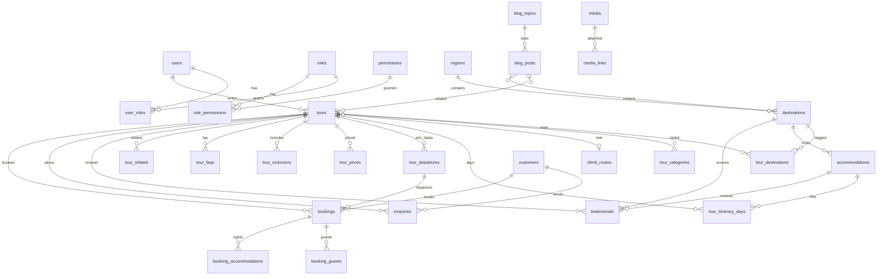

# Relationships

External API DTOs must not expose internal FK column names.

## Cardinality

| Pair | Type | Notes |
|------|------|--------|
| users ↔ roles | M:N `user_roles` | Super Admin + extra roles allowed |
| tours ↔ destinations | M:N `tour_destinations` | Order via `sort_order` |
| tours ↔ categories | M:N `tour_category_links` | wildlife, luxury, mountain, … |
| tour → itinerary days | 1:N | Optional `accommodation_id`; `accommodation_text` when the lodge is not in catalog |
| tour → prices | 1:N | Card `price_from` also stored on `tours` |
| tour → inclusions | 1:N | `included = false` is an exclusion |
| tour → departures | 1:N | Join safari; `start_date` null = open 2026–27 style |
| tour → climb_route | N:1 | Kilimanjaro / Meru |
| tour ↔ tour | M:N `tour_related` | Related packages |
| destination → region | N:1 | |
| accommodation → destination | N:1 | Place label kept when unlinked |
| blog post ↔ tours / destinations | M:N | |
| testimonial → tour / destination / lodge | N:1 optional | |
| enquiry → customer, tour, departure | N:1 optional | Public forms create/upsert customer |
| booking → customer, tour, departure, enquiry, vehicle | N:1 optional | `safari_title` snapshot if the tour is later archived |
| booking → guests | 1:N | |
| booking → accommodation nights | 1:N | |
| media ↔ any resource | M:N `media_links` | `resource_type` + `resource_id` + `role` |
| seo_metadata | 1 per resource | `resource_type` + `resource_id` unique |
| cms_safaris → tours | N:1 optional | Transition FK |
| cms_users → users | N:1 optional | Transition FK |

## Product types on one `tours` table

Join safaris are tours with `product_type = join_safari` plus `tour_departures`. Kilimanjaro treks are `product_type = kilimanjaro` plus `climb_route_id`. Private safaris are the default. Day trips, beach, cultural, and Meru use the same itinerary / price / inclusion shape.

## Media

Prefer `media_links` over duplicating URLs. Listing columns (`tours.hero_image_id`, `destinations.image_id`) exist for cheap card queries.
